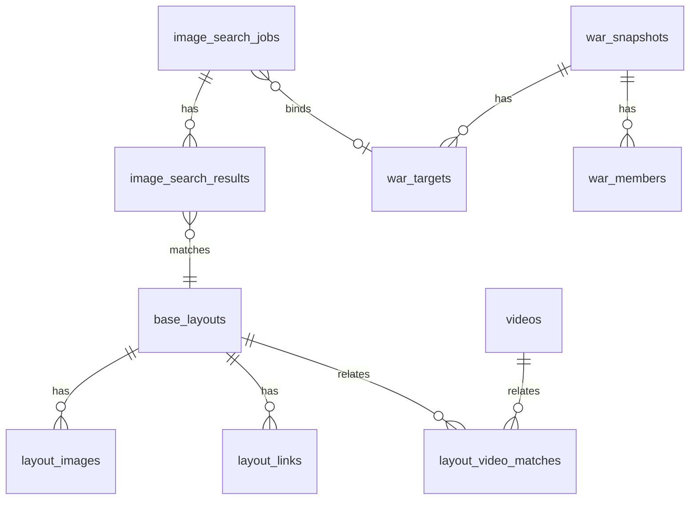

# WarSpark 数据模型说明

## 1. 文档目的

本文档定义 WarSpark MVP 和后续 V1/V2 需要使用的核心数据模型。它用于指导数据库设计、接口字段设计、页面规格对齐和后续迁移编写。

本文档只定义业务实体、字段边界和关系，不直接生成数据库迁移。

## 2. 建模原则

- 找阵任务、阵型、图片、链接、视频、战争数据分开建模。
- 所有外部内容都记录来源、审核状态、质量状态和可用状态。
- MVP 字段和后续预留字段明确区分。
- 找阵流程不依赖战争数据，但可以绑定战争目标上下文。
- 阵型库是可浏览资产，不只是内部匹配表。
- 视频是参考证据，不表示系统推荐打法。

## 3. 核心实体关系

## 4. 通用枚举

### 4.1 来源类型 `source_type`

| 值 | 含义 |
| --- | --- |
| `user_upload` | 用户上传。 |
| `public_page` | 公开网页。 |
| `official_api` | Clash of Clans 官方 API。 |
| `authorized_import` | 用户授权导入。 |
| `manual_entry` | 人工录入。 |
| `search_result` | 找阵结果沉淀。 |

### 4.2 审核状态 `review_status`

| 值 | 含义 |
| --- | --- |
| `reviewed` | 已审核。 |
| `pending_review` | 待审核。 |
| `rejected` | 已拒绝，不公开展示。 |
| `needs_update` | 需要补充或修复。 |

### 4.3 质量状态 `quality_status`

| 值 | 含义 |
| --- | --- |
| `high_confidence` | 高可信。 |
| `medium_confidence` | 可参考。 |
| `low_confidence` | 低可信。 |
| `unknown` | 未判断。 |

### 4.4 链接状态 `link_status`

| 值 | 含义 |
| --- | --- |
| `active` | 可用。 |
| `broken` | 失效。 |
| `unverified` | 未验证。 |
| `missing` | 暂无链接。 |

### 4.5 找阵任务状态 `search_status`

| 值 | 含义 |
| --- | --- |
| `created` | 任务已创建。 |
| `processing` | 正在处理。 |
| `matched` | 找到候选结果。 |
| `low_confidence` | 有候选但可信度低。 |
| `no_result` | 无候选结果。 |
| `failed` | 处理失败。 |

## 5. `base_layouts` 阵型主表

职责：

- 表示一个可浏览、可匹配、可复用的 CoC 阵型。
- 是阵型库列表和详情页的核心实体。
- 可由人工录入、公开页面、授权导入或找阵结果沉淀生成。

MVP 字段：

| 字段 | 类型建议 | 说明 |
| --- | --- | --- |
| `id` | string / uuid | 阵型 ID。 |
| `title` | string | 阵型标题，可由 TH 和类型生成。 |
| `th_level` | int | Town Hall 等级。 |
| `layout_type` | string | War、CWL、Trophy、Farm、Legend 等。 |
| `style_tags` | string array / json | Ring、Box、Diamond、Island 等。 |
| `source_type` | enum | 来源类型。 |
| `source_url` | string nullable | 来源页面。 |
| `review_status` | enum | 审核状态。 |
| `quality_status` | enum | 质量状态。 |
| `visibility` | string | `public`、`hidden`。 |
| `created_at` | datetime | 创建时间。 |
| `updated_at` | datetime | 更新时间。 |

后续预留：

- `description`
- `version_tag`
- `meta_tags`
- `view_count`
- `copy_count`
- `last_verified_at`

关系：

- 一个阵型有多张图片。
- 一个阵型有多个复制链接。
- 一个阵型可关联多个视频。
- 一个阵型可出现在多个找阵结果中。

约束：

- `th_level` 是阵型库筛选的必备字段。
- 低可信阵型可以展示，但必须明确标记。
- `visibility = hidden` 的阵型不进入公开列表。

## 6. `layout_images` 阵型图片表

职责：

- 保存阵型图片引用。
- 区分主图、上传图、候选图和审核图。

MVP 字段：

| 字段 | 类型建议 | 说明 |
| --- | --- | --- |
| `id` | string / uuid | 图片 ID。 |
| `layout_id` | string / uuid nullable | 关联阵型。 |
| `image_url` | string | 图片地址或对象存储地址。 |
| `source_type` | enum | 图片来源。 |
| `source_url` | string nullable | 原始来源 URL。 |
| `width` | int nullable | 图片宽度。 |
| `height` | int nullable | 图片高度。 |
| `image_role` | string | `primary`、`upload`、`candidate`、`reference`。 |
| `review_status` | enum | 审核状态。 |
| `quality_status` | enum | 质量状态。 |
| `created_at` | datetime | 创建时间。 |

约束：

- 阵型详情页需要一张 `primary` 图片。
- 用户上传图片不默认成为公开主图。
- 图片来源不明时不得标记为已审核。

## 7. `layout_links` 阵型链接表

职责：

- 保存 OpenLayout 和后续可能支持的官方复制链接、备用链接。

MVP 字段：

| 字段 | 类型建议 | 说明 |
| --- | --- | --- |
| `id` | string / uuid | 链接 ID。 |
| `layout_id` | string / uuid | 关联阵型。 |
| `link_type` | string | `open_layout`、`official_copy`、`backup`。 |
| `url` | string | 链接地址。 |
| `link_status` | enum | 链接状态。 |
| `source_type` | enum | 来源类型。 |
| `source_url` | string nullable | 来源页面。 |
| `last_checked_at` | datetime nullable | 最后验证时间。 |
| `created_at` | datetime | 创建时间。 |

约束：

- MVP 至少支持 `open_layout`。
- `broken` 状态的链接不得展示可复制动作。
- 同一个阵型可以没有可用链接。

## 8. `videos` 视频表

职责：

- 保存可打开的 YouTube 视频和时间戳基础信息。
- 视频用于学习参考和防守回放，不代表系统推荐打法。

MVP 字段：

| 字段 | 类型建议 | 说明 |
| --- | --- | --- |
| `id` | string / uuid | 视频记录 ID。 |
| `youtube_video_id` | string | YouTube 视频 ID。 |
| `title` | string | 视频标题。 |
| `channel_name` | string nullable | 频道名称。 |
| `published_at` | datetime nullable | 发布时间。 |
| `source_type` | enum | 来源类型。 |
| `source_url` | string nullable | 来源页面或录入来源。 |
| `review_status` | enum | 审核状态。 |
| `visibility` | string | `public`、`hidden`。 |
| `created_at` | datetime | 创建时间。 |

后续预留：

- `channel_id`
- `duration_seconds`
- `language`
- `view_count`

约束：

- 不保存下载后的视频文件。
- 不要求自动识别配兵或流派。

## 9. `layout_video_matches` 阵型视频关联表

职责：

- 表达阵型和视频时间戳之间的关系。
- 区分进攻视频、防守回放、相似参考、同 TH 参考。

MVP 字段：

| 字段 | 类型建议 | 说明 |
| --- | --- | --- |
| `id` | string / uuid | 关联 ID。 |
| `layout_id` | string / uuid | 阵型 ID。 |
| `video_id` | string / uuid | 视频 ID。 |
| `timestamp_seconds` | int | YouTube 时间戳秒数。 |
| `match_group` | string | `attack_video`、`defense_replay`。 |
| `match_type` | string | `exact`、`similar`、`same_th`。 |
| `stars` | int nullable | 星数。 |
| `destruction_percent` | decimal nullable | 摧毁率。 |
| `video_tags` | string array / json | 视频标签。 |
| `confidence_score` | decimal nullable | 关联可信度。 |
| `review_status` | enum | 审核状态。 |
| `created_at` | datetime | 创建时间。 |

约束：

- `exact` 必须有较高可信依据。
- `same_th` 不能展示成精确关联。
- `timestamp_seconds` 是 MVP 视频跳转的关键字段。

## 10. `image_search_jobs` 找阵任务表

职责：

- 保存一次截图找阵任务。
- 记录上传图片、处理状态、识别结果和目标上下文。

MVP 字段：

| 字段 | 类型建议 | 说明 |
| --- | --- | --- |
| `id` | string / uuid | 找阵任务 ID。 |
| `uploaded_image_id` | string / uuid | 上传图片 ID。 |
| `search_status` | enum | 任务状态。 |
| `detected_th` | int nullable | 识别 TH。 |
| `screenshot_quality` | string nullable | 截图质量。 |
| `buildings_detected` | int nullable | 可见建筑数量。 |
| `error_code` | string nullable | 错误码。 |
| `error_message` | string nullable | 错误信息。 |
| `target_context` | json nullable | 战争目标上下文。 |
| `created_at` | datetime | 创建时间。 |
| `updated_at` | datetime | 更新时间。 |

后续预留：

- `processing_started_at`
- `processing_finished_at`
- `algorithm_version`
- `model_version`

约束：

- 找阵任务可以没有战争目标上下文。
- 失败状态必须保留错误信息。

## 11. `image_search_results` 找阵结果表

职责：

- 保存找阵任务返回的阵型候选。
- 让找阵结果可追溯、可复用、可沉淀到阵型库。

MVP 字段：

| 字段 | 类型建议 | 说明 |
| --- | --- | --- |
| `id` | string / uuid | 结果 ID。 |
| `search_job_id` | string / uuid | 找阵任务 ID。 |
| `layout_id` | string / uuid nullable | 候选阵型 ID。 |
| `rank` | int | 排序。 |
| `match_level` | string | `high`、`medium`、`low`。 |
| `confidence_score` | decimal nullable | 可信度。 |
| `result_reason` | string nullable | 匹配说明。 |
| `created_at` | datetime | 创建时间。 |

约束：

- `low` 结果必须在前端显示低置信度。
- 无结果时可没有结果记录，但任务状态为 `no_result`。

## 12. `war_snapshots` 战争快照表

职责：

- 保存某次官方 API 或样例数据返回的战争状态。
- MVP 只预留，V1 完整使用。

V1 字段：

| 字段 | 类型建议 | 说明 |
| --- | --- | --- |
| `id` | string / uuid | 快照 ID。 |
| `clan_tag` | string | 我方部落 tag。 |
| `opponent_clan_tag` | string nullable | 敌方部落 tag。 |
| `war_state` | string | 准备日、战斗日、已结束等。 |
| `team_size` | int nullable | 战争人数。 |
| `clan_stars` | int nullable | 我方星数。 |
| `opponent_stars` | int nullable | 敌方星数。 |
| `clan_destruction` | decimal nullable | 我方摧毁率。 |
| `opponent_destruction` | decimal nullable | 敌方摧毁率。 |
| `source_type` | enum | 通常为 `official_api`。 |
| `fetched_at` | datetime | 获取时间。 |

约束：

- 官方 API 不可用时不阻塞找阵。
- 快照数据用于上下文，不作为 MVP 找阵依赖。

## 13. `war_members` 战争成员表

职责：

- 保存战争快照中的成员状态。

V1 字段：

| 字段 | 类型建议 | 说明 |
| --- | --- | --- |
| `id` | string / uuid | 成员记录 ID。 |
| `war_snapshot_id` | string / uuid | 战争快照 ID。 |
| `side` | string | `clan`、`opponent`。 |
| `map_position` | int | 战争地图序号。 |
| `player_tag` | string nullable | 玩家 tag。 |
| `player_name` | string | 玩家名。 |
| `th_level` | int nullable | TH。 |
| `attacks_used` | int nullable | 已用攻击次数。 |
| `best_stars_against` | int nullable | 被打最佳星数。 |
| `best_destruction_against` | decimal nullable | 被打最佳摧毁率。 |

## 14. `war_targets` 战争目标上下文表

职责：

- 连接战争目标和找阵任务。
- MVP 可以用 JSON 预留，V1 可以独立成表。

V1 字段：

| 字段 | 类型建议 | 说明 |
| --- | --- | --- |
| `id` | string / uuid | 目标 ID。 |
| `war_snapshot_id` | string / uuid | 战争快照 ID。 |
| `war_member_id` | string / uuid | 敌方成员 ID。 |
| `search_job_id` | string / uuid nullable | 关联找阵任务。 |
| `target_position` | int | 敌方序号。 |
| `target_name` | string | 敌方玩家名。 |
| `target_th` | int nullable | 敌方 TH。 |
| `created_at` | datetime | 创建时间。 |

## 15. MVP 数据闭环

MVP 需要支持以下闭环：

1. 用户上传截图，生成 `layout_images` 和 `image_search_jobs`。
2. 找阵任务返回候选，生成 `image_search_results`。
3. 候选阵型关联 `base_layouts`。
4. 阵型展示主图和 OpenLayout，依赖 `layout_images` 和 `layout_links`。
5. 阵型关联视频，依赖 `videos` 和 `layout_video_matches`。
6. 找阵结果可沉淀为新的 `base_layouts`。

## 16. 后续版本预留

V1 战争数据接入：

- 使用 `war_snapshots`。
- 使用 `war_members`。
- 使用 `war_targets`。
- 找阵任务绑定战争目标。

V2 复盘资料沉淀：

- 增强战争攻击记录。
- 增强防守表现统计。
- 增强阵型和视频关联。
- 增加人工审核和内容运营流程。

暂不建模：

- 用户账号。
- 收藏、点赞、评论。
- 支付、订单、会员。
- 自动配兵识别。
- AI 打法推荐。

## 17. 验收标准

数据模型文档视为完成时，需要满足：

- 定义阵型、图片、链接、视频、匹配记录、搜索任务、战争快照等核心实体。
- 明确每个实体职责。
- 明确实体关系。
- 明确 MVP 字段和后续预留字段。
- 明确来源、审核、质量、链接、任务状态等通用枚举。
- 能支撑 MVP 页面和用户流程。
