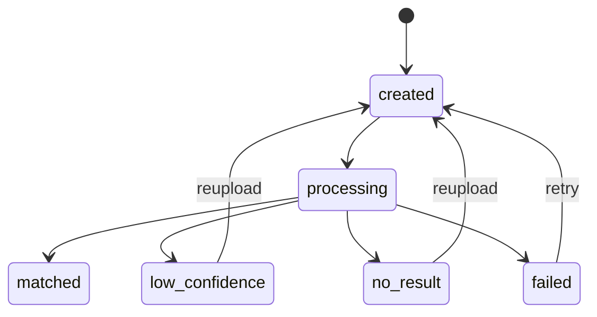

# 截图找阵技术设计

## 1. 文档目的

本文档定义 WarSpark 截图找阵功能的内部实现逻辑，包括上传、任务状态、TH 识别、候选匹配、低置信度、无结果、失败重试和结果沉淀。

本文档基于：

- `docs/product/mvp-scope.md`
- `docs/product/user-flows.md`
- `docs/product/page-spec.md`
- `docs/architecture/data-model.md`
- `docs/architecture/system-architecture.md`

## 2. 功能目标

截图找阵的目标是让用户上传一张 CoC 阵型截图后，获得：

- 基础识别信息。
- 相似阵型候选。
- 相关攻击视频和防守回放入口。
- OpenLayout 或无链接状态。
- 低置信度、无结果、失败状态。

MVP 不承诺精确 AI 识别，不自动识别配兵、流派或完整打法。

## 3. 模块边界

截图找阵涉及以下模块：

| 模块 | 职责 |
| --- | --- |
| Upload Handler | 接收图片、校验格式和大小。 |
| Storage Adapter | 保存上传图片。 |
| Image Search Service | 创建任务、读取任务、组织结果。 |
| Image Search Worker | 执行识别、候选匹配、状态更新。 |
| Layout Matcher | 根据样本或规则返回候选阵型。 |
| Layout Library | 提供候选阵型、图片和链接。 |
| Video Reference | 提供候选阵型关联的视频和防守回放。 |

## 4. 状态机

状态说明：

| 状态 | 触发条件 | 页面表现 |
| --- | --- | --- |
| `created` | 上传成功，任务已创建 | 显示等待处理。 |
| `processing` | Worker 开始处理 | 显示处理中。 |
| `matched` | 找到高或中可信候选 | 展示完整结果。 |
| `low_confidence` | 有候选但可信度低 | 展示低置信度提示和候选。 |
| `no_result` | 无候选 | 展示无结果状态。 |
| `failed` | 上传、识别或匹配失败 | 展示失败原因和重新上传入口。 |

## 5. 上传处理

输入：

- 图片文件。
- 可选目标上下文：敌方序号、玩家名、预期 TH、战争目标 ID。

校验：

- 文件必须是支持的图片格式。
- 文件大小必须低于系统限制。
- 文件必须能读取尺寸。
- 文件不能作为服务器本地路径直接读取。

处理：

1. Handler 校验文件。
2. Storage Adapter 保存原图。
3. 写入 `layout_images`，`image_role = upload`。
4. 写入 `image_search_jobs`，状态为 `created`。
5. 返回任务 ID。

失败：

- 格式错误：不创建任务。
- 文件过大：不创建任务。
- 存储失败：返回上传失败。

## 6. 任务处理

Worker 执行顺序：

1. 将任务状态改为 `processing`。
2. 读取上传图片。
3. 执行基础图片质量检查。
4. 尝试识别 TH。
5. 执行候选匹配。
6. 写入 `image_search_results`。
7. 根据结果更新任务状态。

基础识别结果：

- `detected_th`
- `screenshot_quality`
- `buildings_detected`
- `error_code`
- `error_message`

MVP 允许：

- TH 识别由规则、人工样本或半自动流程支持。
- 建筑数量可以为空。
- 候选匹配可以基于人工样本和元数据，不要求向量检索。

## 7. 候选匹配

候选来源：

- 已审核阵型。
- 待审核阵型。
- 找阵结果沉淀阵型。
- 人工维护样本。

匹配输出：

- 候选阵型 ID。
- 排序。
- 匹配等级：`high`、`medium`、`low`。
- 可选可信度分数。
- 匹配说明。

状态判定：

- 有 `high` 或 `medium` 候选：任务状态为 `matched`。
- 只有 `low` 候选：任务状态为 `low_confidence`。
- 无候选：任务状态为 `no_result`。
- 处理异常：任务状态为 `failed`。

展示规则：

- `low` 候选必须展示低置信度提示。
- `same_th` 视频不能作为精确匹配证据。
- 无结果不展示伪造候选。

## 8. 结果聚合

找阵结果页读取：

- `image_search_jobs`
- `image_search_results`
- `base_layouts`
- `layout_images`
- `layout_links`
- `layout_video_matches`
- `videos`

结果分组：

- 检测信息。
- 匹配摘要。
- 相似阵型。
- 进攻视频。
- 防守回放。
- OpenLayout。
- 无结果或低置信度提示。

聚合原则：

- 结果页可以没有战争上下文。
- 结果页可以没有视频。
- 结果页可以没有 OpenLayout。
- 缺少某类数据时展示明确空状态。

## 9. 结果沉淀

当找阵结果包含可用阵型图片或 OpenLayout 时，系统可以沉淀阵型库资产。

沉淀规则：

1. 如果候选已有关联 `base_layouts`，只关联本次搜索结果。
2. 如果没有阵型记录，但有可用图片和基础 TH 信息，可以创建新 `base_layouts`。
3. 来源标记为 `search_result`。
4. 审核状态默认为 `pending_review`。
5. 质量状态根据匹配等级设置。
6. OpenLayout 写入 `layout_links`，状态为 `unverified` 或 `active`。

不自动沉淀：

- 无图片。
- 无 TH。
- 明显非 CoC 阵型截图。
- 处理失败任务。

## 10. 重试策略

允许用户重试：

- 重新上传更清晰截图。
- 从 `failed` 状态重新创建任务。
- 从 `no_result` 状态重新上传。
- 从 `low_confidence` 状态重新上传。

不做自动无限重试。

内部重试：

- 临时存储读取失败可以重试一次。
- 外部服务不可用不阻塞基础结果展示。

## 11. 错误码建议

| 错误码 | 场景 |
| --- | --- |
| `unsupported_file_type` | 文件格式不支持。 |
| `file_too_large` | 文件超过限制。 |
| `image_unreadable` | 图片无法读取。 |
| `storage_failed` | 存储失败。 |
| `processing_failed` | 处理异常。 |
| `matcher_unavailable` | 匹配服务不可用。 |

## 12. 可观测性

需要记录：

- 上传任务数量。
- 任务状态分布。
- 上传到结果页完成率。
- `matched`、`low_confidence`、`no_result`、`failed` 比例。
- 平均处理耗时。
- 结果页视频点击率。
- OpenLayout 点击或复制率。

## 13. 不做事项

MVP 不做：

- 精确 AI 识别承诺。
- 大规模视频帧索引。
- 自动识别流派、配兵、打法。
- YouTube 视频下载。
- 批量上传。
- 登录态历史记录。

## 14. 验收标准

截图找阵技术设计视为完成时，需要满足：

- 定义上传、任务状态、处理流程和结果聚合。
- 定义匹配结果和状态判定。
- 定义低置信度、无结果、失败状态。
- 定义结果沉淀阵型库规则。
- 明确 MVP 不做事项。
