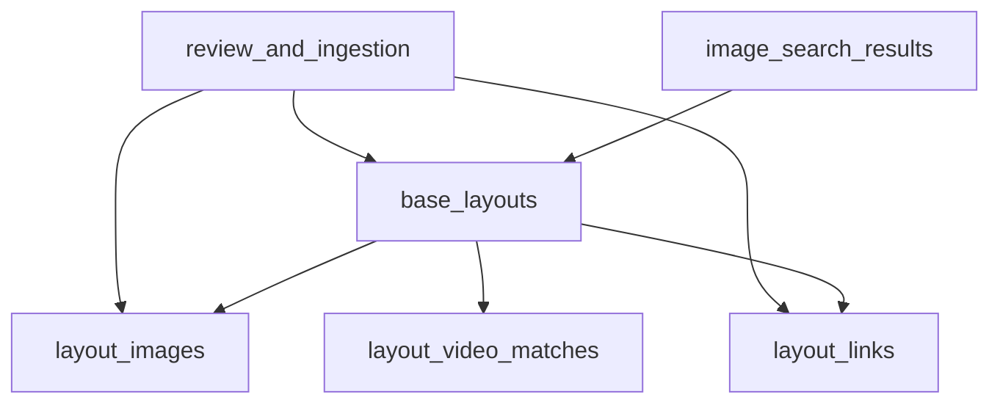

# WarSpark 阵型库技术设计

## 1. 文档目的

本文档定义 WarSpark 轻量阵型库的实现逻辑，用于指导阵型入库、列表筛选、详情聚合、OpenLayout 状态和找阵结果沉淀。本文档不设计完整运营后台，也不定义最终 API 字段，接口细节由 `docs/api/api-contract.md` 维护。

## 2. 功能定位

阵型库不是 WarSpark MVP 的首屏核心，但它是截图找阵和视频参考的底层资产库。它需要支撑：

- 找阵结果页展示相似阵型。
- 阵型详情页展示图片、来源、OpenLayout、视频和防守回放。
- 找阵过程中发现的新阵型沉淀成可浏览资产。
- 运营人员后续补充图片、链接、视频和审核状态。

阵型库不承诺首版成为完整 CoC 阵型资源站，不做用户投稿、收藏、评论、付费阵型和复杂 SEO 内容系统。

## 3. 模块边界

| 子模块 | 职责 |
| --- | --- |
| Layout Record | 维护 `base_layouts` 主记录，包括 TH、类型、风格、来源、审核和质量状态。 |
| Layout Image | 维护 `layout_images`，区分主图、上传图、候选图和参考图。 |
| Layout Link | 维护 `layout_links`，保存 OpenLayout 和链接可用状态。 |
| Layout Query | 支撑阵型列表筛选、排序和详情聚合。 |
| Layout Association | 支撑找阵结果、视频、战争复盘和阵型之间的关联。 |

## 4. 核心数据关系

实现约束：

- `base_layouts` 是阵型库的聚合根。
- 阵型详情页不能只依赖 `image_search_results`，必须能独立读取 `base_layouts`。
- 用户上传截图默认不直接成为公开阵型主图，只有通过审核或人工确认后才能作为主图展示。
- OpenLayout 链接和阵型图片都必须记录来源和状态。

## 5. 阵型入库逻辑

### 5.1 入库来源

| 来源 | 处理方式 |
| --- | --- |
| `manual_entry` | 人工录入阵型、图片、OpenLayout 和标签，默认可进入审核流程。 |
| `public_page` | 从公开页面整理的阵型，必须记录来源 URL 和审核状态。 |
| `authorized_import` | 用户授权导入的数据，必须记录授权来源和导入批次。 |
| `search_result` | 找阵结果沉淀的候选阵型，默认标记为低或中可信，等待补充审核。 |
| `user_upload` | 用户上传原图只作为任务输入，不默认公开展示。 |

### 5.2 新建阵型步骤

1. 创建 `base_layouts` 主记录。
2. 写入 TH、阵型类型、风格标签、来源类型。
3. 创建至少一条 `layout_images` 记录。
4. 如果有 OpenLayout，创建 `layout_links` 记录。
5. 设置 `review_status`、`quality_status`、`visibility`。
6. 写入来源 URL 或导入批次信息。
7. 可选关联已有视频或找阵结果。

### 5.3 初始状态建议

| 场景 | 审核状态 | 质量状态 | 可见性 |
| --- | --- | --- | --- |
| 人工确认的高质量阵型 | `reviewed` | `high_confidence` | `public` |
| 公开页面整理但未复核 | `pending_review` | `medium_confidence` | `public` 或 `hidden` |
| 找阵结果自动沉淀 | `pending_review` | `low_confidence` | `hidden` 或受限展示 |
| 来源不完整 | `needs_update` | `unknown` | `hidden` |
| 已拒绝内容 | `rejected` | `unknown` | `hidden` |

MVP 可以先通过种子数据或人工维护入库，不需要提供用户侧投稿入口。

## 6. 阵型去重与合并

### 6.1 去重维度

阵型去重不依赖单一字段，需要结合：

- TH 等级。
- 阵型类型。
- 主图相似度或人工判断。
- OpenLayout URL。
- 来源页面 URL。
- 已有关联视频和时间戳。

### 6.2 合并策略

当新入库内容疑似重复时：

1. 优先保留已有 `base_layouts` 主记录。
2. 新图片作为 `layout_images` 的 `reference` 或 `candidate` 图片。
3. 新 OpenLayout 作为备用 `layout_links` 记录。
4. 新视频写入 `layout_video_matches`。
5. 来源信息追加到审核或导入记录中。

MVP 可以先做宽松去重：OpenLayout URL 完全相同或人工确认相同时合并，其余进入待审核队列。

## 7. OpenLayout 状态逻辑

### 7.1 链接状态

| 状态 | 展示逻辑 |
| --- | --- |
| `active` | 展示打开和复制动作。 |
| `unverified` | 展示链接，但标记未验证。 |
| `broken` | 禁用打开和复制动作。 |
| `missing` | 展示暂无复制链接。 |

### 7.2 链接检查

链接检查可以由人工审核或 Worker 执行：

1. 读取 `layout_links` 中需要检查的记录。
2. 对 OpenLayout URL 做格式校验。
3. 可选执行轻量可访问性检查。
4. 更新 `link_status` 和 `last_checked_at`。
5. 失败时保留原记录，不直接删除链接。

实现边界：

- 不绕过第三方站点限制。
- 不模拟登录获取链接。
- 不把失效链接从页面静默移除，必须展示状态或替代链接。

## 8. 阵型列表查询

### 8.1 MVP 筛选条件

| 条件 | 字段 |
| --- | --- |
| TH | `base_layouts.th_level` |
| 类型 | `base_layouts.layout_type` |
| 风格 | `base_layouts.style_tags` |
| 来源 | `base_layouts.source_type` |
| 审核状态 | `base_layouts.review_status` |
| 质量状态 | `base_layouts.quality_status` |
| 链接状态 | 聚合 `layout_links.link_status` |

### 8.2 默认查询规则

- 默认只展示 `visibility = public` 的阵型。
- 默认隐藏 `review_status = rejected` 的阵型。
- 默认优先展示有主图的阵型。
- 可用链接不是展示阵型的硬要求，但必须在卡片上显示链接状态。
- 低可信阵型可以展示，但必须有明确标记。

### 8.3 排序建议

MVP 使用简单排序：

1. 高质量且已审核。
2. 有可用 OpenLayout。
3. 有关联视频。
4. 最近更新。

后续再扩展浏览量、复制次数、视频数量、防守表现等排序维度。

## 9. 阵型详情聚合

详情页需要聚合：

- `base_layouts` 基础信息。
- 主图和参考图。
- OpenLayout 和其他复制链接。
- 相关攻击视频。
- 防守回放。
- 相似阵型。
- 来源、审核状态、质量状态。

聚合规则：

1. 主图优先取 `image_role = primary` 且可用的图片。
2. 没有主图时，使用已审核参考图。
3. 没有可用图片时展示图片不可用状态。
4. OpenLayout 优先展示 `active` 链接。
5. 失效链接保留状态，不展示为可复制。
6. 视频按 `attack_video` 和 `defense_replay` 分组。
7. 低可信关联必须标记为相似参考或同 TH 参考。

## 10. 找阵结果关联

### 10.1 已有阵型命中

当找阵任务命中已有阵型：

1. `image_search_results.layout_id` 指向已有 `base_layouts`。
2. 结果页展示阵型卡片、链接和视频。
3. 用户进入详情页时读取阵型库详情。
4. 上传图保留在找阵任务中，不覆盖阵型主图。

### 10.2 新候选沉淀

当找阵任务产生可沉淀的新候选：

1. 创建隐藏或低可信阵型记录。
2. 上传图或候选图写入 `layout_images`。
3. 设置 `source_type = search_result`。
4. 设置 `review_status = pending_review`。
5. 设置 `quality_status = low_confidence` 或 `medium_confidence`。
6. 等待人工补充 OpenLayout、来源和视频。

沉淀不等于公开。只有达到可展示条件后，阵型才进入公开列表。

## 11. 错误与空状态

| 场景 | 处理方式 |
| --- | --- |
| 阵型不存在 | 返回不存在或已隐藏状态。 |
| 阵型被拒绝 | 不在公开列表展示，详情页按隐藏处理。 |
| 主图不可访问 | 展示图片不可用，占位不影响基础信息。 |
| 无 OpenLayout | 展示暂无复制链接。 |
| OpenLayout 失效 | 禁用打开和复制动作。 |
| 无关联视频 | 展示无相关视频状态。 |
| 筛选无结果 | 展示重置筛选动作。 |

## 12. 非目标

MVP 阵型库不做：

- 用户投稿入口。
- 用户收藏、点赞、评论。
- 付费阵型和会员权限。
- 完整内容运营后台。
- 阵型热度算法。
- 自动生成阵型标题和攻略文案。
- 自动识别配兵链接或打法。

## 13. 验收标准

阵型库技术设计视为可进入实现时，需要满足：

- 阵型可由人工样本、公开页面、授权导入或找阵结果沉淀生成。
- 阵型主记录、图片、OpenLayout、视频关联职责清晰。
- 列表页支持 TH、类型、风格、来源、审核状态等基础筛选。
- 详情页能聚合图片、链接、来源、质量状态、攻击视频和防守回放。
- OpenLayout 缺失、未验证、失效状态都有明确处理。
- 找阵上传图片不会未经审核直接成为公开阵型主图。
