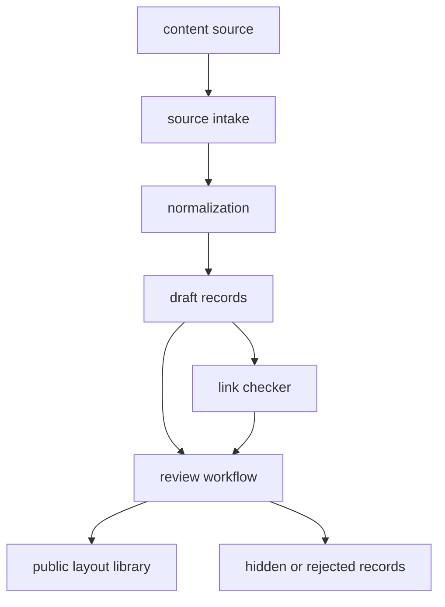
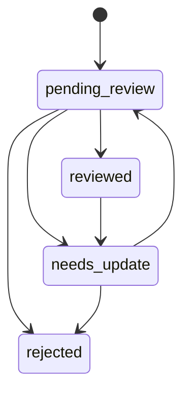

# WarSpark 入库与审核技术设计

## 1. 文档目的

本文档定义 WarSpark 内容入库和审核的技术逻辑，包括公开来源、授权导入、来源记录、审核状态、质量状态、链接状态和找阵结果沉淀。

本文档基于 `docs/product/content-data-policy.md` 和 `docs/architecture/data-model.md`，用于约束内容导入、后台审核、链接检查和运营流程实现。

## 2. 功能定位

入库与审核模块负责把外部资料和用户流程中产生的资料转化为可追踪、可审核、可展示的 WarSpark 内容资产。

需要处理的内容包括：

- 阵型图片。
- 官方游戏打开链接、来源页面和备用链接。
- YouTube 视频和时间戳。
- 找阵结果候选。
- 战争复盘后沉淀的阵型和视频关联。

模块不负责绕过第三方站点限制，不负责抓取私域内容，也不负责自动生成攻略或打法结论。

## 3. 模块边界

| 子模块 | 职责 |
| --- | --- |
| Source Intake | 接收公开页面、授权导入、后台录入和找阵结果沉淀。 |
| Source Normalization | 标准化图片、链接、视频、TH、标签和来源字段。 |
| Review Workflow | 维护审核状态、质量状态和公开可见性。 |
| Link Checker | 检查阵型链接和 YouTube 链接可用性。 |
| Ingestion Worker | 处理批量导入、链接检查和状态更新。 |

## 4. 允许来源

| 来源类型 | 使用边界 |
| --- | --- |
| 用户上传 | 用于找阵任务输入，不默认公开展示。 |
| 公开阵型页面 | 可整理公开可访问的图片、链接和说明，必须记录来源 URL。 |
| 阵型链接 | 可保存 `official_open_layout`、`source_page`、`backup` 和状态，不绕过第三方限制。 |
| YouTube 公开视频 | 只保存视频 ID、标题、频道和时间戳，不下载视频。 |
| Clash of Clans 官方 API | 用于战争数据和玩家数据，遵守 API 访问边界。 |
| 用户授权导入 | 只处理用户有权提供的文件、表格或导出内容。 |
| 后台录入 | 由运营或开发人员在内部管理后台维护种子数据和修正数据。 |

## 5. 禁止默认来源

默认不接入：

- 私有 Discord 或 Telegram 频道抓取。
- 需要登录绕过的页面。
- 付费内容绕过。
- YouTube 视频下载或转存。
- 游戏客户端自动化、逆向或模拟操作。
- 未授权的批量抓取。

如果后续要支持社区授权导入，必须作为独立流程设计，明确授权、来源记录和审核责任。

## 6. 入库数据流

标准流程：

1. 接收来源数据。
2. 校验来源类型和最小字段。
3. 标准化图片、链接、视频和 TH 信息。
4. 写入草稿业务记录。
5. 设置审核状态和质量状态。
6. 检查链接状态。
7. 审核通过后进入公开展示范围。

## 7. 来源记录

每条可展示资产必须保留来源信息。

### 7.1 阵型来源

`base_layouts` 需要保存：

- `source_type`
- `source_url`
- `review_status`
- `quality_status`
- `visibility`

### 7.2 图片来源

`layout_images` 需要保存：

- 图片地址。
- 来源类型。
- 来源 URL。
- 图片角色。
- 审核状态。
- 质量状态。

### 7.3 链接来源

`layout_links` 需要保存：

- 链接类型。
- URL。
- 链接状态。
- 来源类型。
- 来源 URL。
- 最后检查时间。

### 7.4 视频来源

`videos` 和 `layout_video_matches` 需要保存：

- YouTube 视频 ID。
- 时间戳秒数。
- 来源类型。
- 关联分组。
- 关联精度。
- 审核状态。
- 可信度。

## 8. 标准化逻辑

### 8.1 图片标准化

图片入库时处理：

- 校验文件类型和大小。
- 保存到对象存储或兼容存储。
- 记录宽高。
- 标记图片角色。
- 关联阵型或找阵任务。

用户上传图片默认角色为 `upload`，不能直接作为公开主图。

### 8.2 阵型链接标准化

阵型链接入库时处理：

- 去除首尾空格。
- 校验 URL 格式。
- 标准化链接类型为 `official_open_layout`、`source_page` 或 `backup`。
- 初始状态设置为 `unverified` 或 `active`。
- 保存来源 URL。

无法验证的链接不删除，标记为 `unverified`。

### 8.3 YouTube 标准化

YouTube 入库时处理：

- 提取视频 ID。
- 统一时间戳为秒数。
- 标准化同一视频下的多个时间戳。
- 区分进攻视频和防守回放。
- 区分精确关联、相似参考和同 TH 参考。

系统只保存公开视频引用，不保存视频文件。

### 8.4 标签标准化

标签用于筛选和辅助理解，不作为精确算法结论。

MVP 标签范围：

- TH 等级。
- 阵型类型。
- 风格标签。
- 视频轻量标签。
- 来源类型。
- 审核和质量状态。

## 9. 审核状态流转

状态含义：

| 状态 | 含义 |
| --- | --- |
| `pending_review` | 内容已入库，需要审核。 |
| `reviewed` | 内容已确认，可按可见性展示。 |
| `needs_update` | 需要补来源、修链接或补充图片。 |
| `rejected` | 内容不展示，但可保留记录用于追踪。 |

约束：

- `rejected` 不进入公开列表。
- `needs_update` 可以隐藏，也可以在内部审核视图显示。
- `reviewed` 不代表链接永久有效，链接状态仍需独立维护。

## 10. 质量状态逻辑

| 状态 | 使用场景 |
| --- | --- |
| `high_confidence` | 自动高可信或后台确认、来源完整、图片和链接可用。 |
| `medium_confidence` | 来源基本清楚，但匹配或链接仍需补充验证。 |
| `low_confidence` | 找阵结果沉淀或相似参考，不能作为精确结果展示。 |
| `unknown` | 来源或质量信息不足。 |

质量状态影响：

- 找阵结果页的匹配文案。
- 阵型库列表的标记。
- 阵型详情页的可信度提示。
- 是否进入默认公开结果。

## 11. 链接状态逻辑

链接状态独立于审核状态。

| 状态 | 处理方式 |
| --- | --- |
| `active` | 可展示打开和复制动作。 |
| `unverified` | 可展示，但标记未验证。 |
| `broken` | 禁用打开和复制动作。 |
| `missing` | 展示暂无链接。 |

链接检查失败时保留原始记录，并更新 `last_checked_at` 和错误原因。

## 12. 找阵结果沉淀

找阵结果沉淀分两类：

### 12.1 关联已有阵型

当候选结果能匹配已有阵型：

1. `image_search_results.layout_id` 指向已有阵型。
2. 只记录本次任务结果。
3. 不覆盖已有主图和链接。
4. 可累积匹配证据用于后续审核。

### 12.2 生成新候选

当候选结果值得保留但没有对应阵型：

1. 创建隐藏阵型或低可信阵型。
2. 写入候选图片。
3. 设置来源为 `search_result`。
4. 设置 `pending_review` 和 `low_confidence`。
5. 等待后台补充来源、阵型链接和视频。

沉淀记录不等于公开内容，公开展示必须经过可见性和审核判断。

## 13. 批量导入

批量导入可以支持：

- 后台整理的 JSON 或 CSV。
- 授权导出的表格。
- 公开页面整理后的结构化数据。

导入步骤：

1. 上传导入文件或提供结构化数据。
2. 校验字段和来源。
3. 预览将创建或更新的记录数量。
4. 写入业务表。
5. 标记导入批次。
6. 进入审核或链接检查流程。

MVP 可以先不做运营 UI，但需要保留导入批次和来源概念，方便后续追踪。

## 14. Worker 任务

推荐 Worker 任务：

- 图片元信息提取。
- 阵型链接检查。
- YouTube 链接检查。
- 批量导入解析。
- 重复阵型提示。
- 内容状态重算。

MVP 可先用手动脚本或同步逻辑实现，但业务状态应按 Worker 可迁移的方式设计。

## 15. 错误处理

| 场景 | 处理方式 |
| --- | --- |
| 来源 URL 缺失 | 标记 `needs_update`。 |
| 图片无法访问 | 图片状态异常，不公开作为主图。 |
| 阵型链接格式错误 | 标记 `broken` 或拒绝链接。 |
| YouTube ID 无法解析 | 拒绝视频记录或标记需修复。 |
| 导入字段缺失 | 导入失败并输出错误行号。 |
| 疑似重复阵型 | 进入后台确认或合并流程。 |
| 来源不合规 | 标记 `rejected`。 |

错误记录需要包含来源、批次、业务实体 ID 和错误码。

## 16. 非目标

本阶段不做：

- 公开社区后台审核系统。
- 用户侧投稿工作流。
- 自动内容采集平台。
- 私域内容抓取。
- 付费内容绕过。
- 视频下载和转码。
- 自动生成攻略正文。

## 17. 验收标准

入库与审核技术设计视为可进入实现时，需要满足：

- 公开来源、授权导入、后台录入和找阵沉淀的路径清晰。
- 每类内容都有来源记录、审核状态、质量状态或链接状态。
- 用户上传图片不会未经审核直接公开。
- 阵型链接和 YouTube 只保存引用和状态，不绕过访问限制。
- 找阵结果沉淀可以进入阵型库，但公开展示需要审核或可见性判断。
- 批量导入和 Worker 任务有明确扩展路径。
