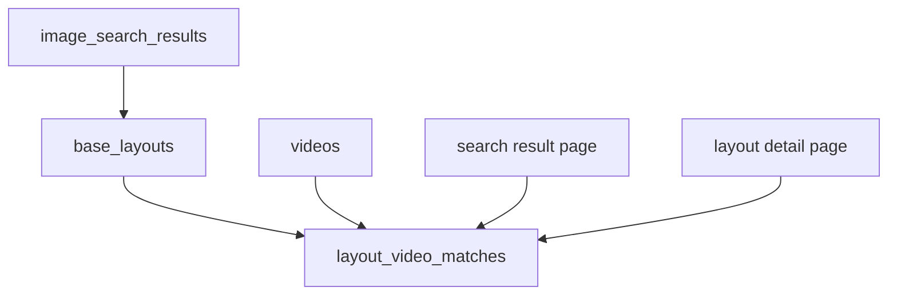

# WarSpark 视频关联技术设计

## 1. 文档目的

本文档定义 WarSpark 中阵型与 YouTube 视频时间戳的关联逻辑，重点说明相关攻击视频、防守回放、精确关联、相似参考、同 TH 参考、视频失效和无视频状态的处理方式。

本文档不设计自动识别打法、配兵链接或视频画面解析。视频在 WarSpark MVP 中是学习参考和证据材料，不是系统推荐打法。

## 2. 功能定位

视频关联服务于三个页面能力：

- 找阵结果页：用户上传截图后，看到与候选阵型相关的攻击视频和防守回放。
- 阵型详情页：用户浏览阵型时，查看该阵或相似阵的历史视频参考。
- 后续复盘：战后把攻击结果、防守结果和阵型资料沉淀到同一套资料库。

核心原则：

- 明确区分“进攻视频”和“防守回放”。
- 明确区分“精确关联”“相似参考”“同 TH 参考”。
- 不把相关视频包装成系统推荐打法。
- 不下载 YouTube 视频，不做视频帧索引承诺。

## 3. 数据模型关系



涉及实体：

| 实体 | 职责 |
| --- | --- |
| `videos` | 保存 YouTube 视频基础信息，如视频 ID、标题、频道、来源和可见性。 |
| `layout_video_matches` | 保存阵型和视频时间戳之间的关联关系。 |
| `base_layouts` | 视频关联的阵型主体。 |
| `image_search_results` | 找阵结果通过 `layout_id` 间接读取视频。 |

## 4. 视频主记录

### 4.1 视频唯一性

`videos.youtube_video_id` 是去重关键字段。同一个 YouTube 视频只保存一条主记录，不同阵型和时间戳通过 `layout_video_matches` 表达。

### 4.2 视频基础字段

MVP 需要：

- YouTube 视频 ID。
- 标题。
- 频道名称。
- 来源类型和来源 URL。
- 审核状态。
- 可见性。

后续可扩展：

- 视频时长。
- 频道 ID。
- 语言。
- 发布时间。
- 视频可访问状态。

### 4.3 视频可见性

| 状态 | 处理方式 |
| --- | --- |
| `public` | 可在找阵结果页和阵型详情页展示。 |
| `hidden` | 不对用户展示，但保留历史关联。 |

视频被隐藏时，不删除 `layout_video_matches`，避免历史数据丢失。

## 5. 关联类型

### 5.1 结果分组 `match_group`

| 值 | 含义 | 页面展示 |
| --- | --- | --- |
| `attack_video` | 用于学习如何进攻该阵或相似阵。 | 进攻视频分组。 |
| `defense_replay` | 展示该阵或相似阵被攻击后的防守表现。 | 防守回放分组。 |

分组必须在页面上显式展示，不允许把两类视频混在一个列表中。

### 5.2 关联精度 `match_type`

| 值 | 含义 | 展示语义 |
| --- | --- | --- |
| `exact` | 视频时间戳中出现的阵型与当前阵型高度一致。 | 同阵参考。 |
| `similar` | 视频时间戳中出现的是相似阵型。 | 相似参考。 |
| `same_th` | 只确认 TH 相同或大类相近。 | 同 TH 参考。 |

约束：

- `exact` 需要人工确认或高可信来源支持。
- `similar` 必须显示为参考，不得暗示完全相同。
- `same_th` 只能作为无精确结果时的补充材料。

## 6. 时间戳逻辑

### 6.1 时间戳保存

`layout_video_matches.timestamp_seconds` 统一保存为秒数，前端生成 YouTube 跳转链接：

```text
https://www.youtube.com/watch?v={youtube_video_id}&t={timestamp_seconds}s
```

### 6.2 时间戳展示

页面展示建议：

- 标题：视频标题。
- 频道：频道名称。
- 时间戳：`mm:ss` 或 `hh:mm:ss`。
- 结果：星数、摧毁率。
- 关联类型：同阵参考、相似参考、同 TH 参考。

### 6.3 时间戳校验

MVP 可以采用人工校验：

1. 确认视频公开可访问。
2. 确认时间戳能跳到相关片段。
3. 确认该片段与阵型或 TH 有关。
4. 设置 `review_status` 和 `confidence_score`。

后续可以加入轻量 Worker 检查 YouTube 链接可访问性，但不下载视频。

## 7. 进攻视频逻辑

### 7.1 适用场景

进攻视频用于回答：

- 这个阵或相似阵有没有被打过。
- 用户可以打开视频自行学习打法。
- 视频结果是否是三星、二星或高摧毁率。

### 7.2 MVP 字段

进攻视频卡片建议读取：

- `video_title`
- `channel_name`
- `timestamp_seconds`
- `match_type`
- `stars`
- `destruction_percent`
- `video_tags`
- `confidence_score`

`video_tags` 只能作为轻量标签，如空军、地面、混合、未知，不作为自动打法识别结果。

### 7.3 排序规则

默认排序：

1. `match_type = exact`
2. 星数高。
3. 摧毁率高。
4. 关联可信度高。
5. 最近审核或最近更新。

当没有精确关联时，允许展示相似参考和同 TH 参考，但必须降低文案承诺。

## 8. 防守回放逻辑

### 8.1 适用场景

防守回放用于回答：

- 这个阵或相似阵被攻击后的结果如何。
- 是否存在未三星、低摧毁率或失败案例。
- 用户能不能从防守表现中判断阵型价值。

### 8.2 MVP 字段

防守回放卡片建议读取：

- `video_title`
- `channel_name`
- `timestamp_seconds`
- `match_type`
- `stars`
- `destruction_percent`
- `confidence_score`

页面文案使用“防守回放”“被打结果”“参考片段”，不使用“防守强度评分”。

### 8.3 排序规则

默认排序：

1. `match_type = exact`
2. 星数低。
3. 摧毁率低。
4. 关联可信度高。
5. 最近审核或最近更新。

防守回放没有结果时，不影响进攻视频和阵型链接展示。

## 9. 视频状态与失效处理

### 9.1 状态来源

视频状态来自：

- 后台审核。
- 用户反馈。
- 链接检查 Worker。
- YouTube 页面不可访问或视频被删除。

### 9.2 失效处理

当视频失效时：

1. 更新视频或关联的可用状态。
2. 页面展示视频不可访问。
3. 禁用打开视频动作。
4. 保留历史关联，不删除记录。
5. 可展示其他可用视频作为替代。

### 9.3 无视频状态

无视频时页面需要按分组展示：

- 无进攻视频：提示暂无相关攻击视频，可查看相似阵型或同 TH 参考。
- 无防守回放：提示暂无防守回放，不影响其他结果。

不要用同 TH 视频填充成精确进攻视频。

## 10. 找阵结果页聚合

找阵结果页根据候选阵型聚合视频：

1. 读取 `image_search_results` 的候选阵型。
2. 按候选阵型读取 `layout_video_matches`。
3. 过滤隐藏视频和拒绝关联。
4. 按 `match_group` 分成进攻视频和防守回放。
5. 每组内部按关联精度、结果和可信度排序。
6. 如果候选阵型无视频，可查同 TH 公开视频作为低承诺参考。

展示约束：

- 精确关联优先展示。
- 相似参考和同 TH 参考必须明确标识。
- 同一个 YouTube 视频不同时间戳可以展示为不同卡片。
- 同一个时间戳不要在同一分组重复展示。

## 11. 阵型详情页聚合

阵型详情页视频区分为：

- 相关攻击视频。
- 防守回放。

详情页可以比找阵结果页展示更多关联材料，但仍需遵守：

- `review_status = rejected` 不展示。
- `visibility = hidden` 不展示。
- 失效视频展示失效状态或隐藏在普通列表之外。
- 低可信关联有明显标记。

## 12. 内容录入边界

允许：

- 手动录入公开视频 ID 和时间戳。
- 从公开页面整理视频链接和时间戳。
- 用户授权导入自有整理表。
- 从战后复盘后台补充视频关联。

不允许作为默认能力：

- 下载 YouTube 视频。
- 自动解析视频画面。
- 绕过登录或付费内容。
- 自动提取配兵链接。
- 自动生成打法步骤。

## 13. 非目标

MVP 视频关联不做：

- 自动识别流派。
- 自动识别配兵链接。
- 自动识别进攻路线。
- 自动计算阵型防守评分。
- 大规模视频帧索引。
- YouTube 视频下载和转存。

## 14. 验收标准

视频关联技术设计视为可进入实现时，需要满足：

- 进攻视频和防守回放在数据和页面展示上明确分组。
- 阵型与视频通过时间戳关联，不把视频主记录重复保存。
- 精确关联、相似参考、同 TH 参考有明确含义和展示边界。
- 视频失效、无视频、低可信关联都有处理方式。
- 文档不承诺自动打法识别、配兵识别或视频帧索引。
