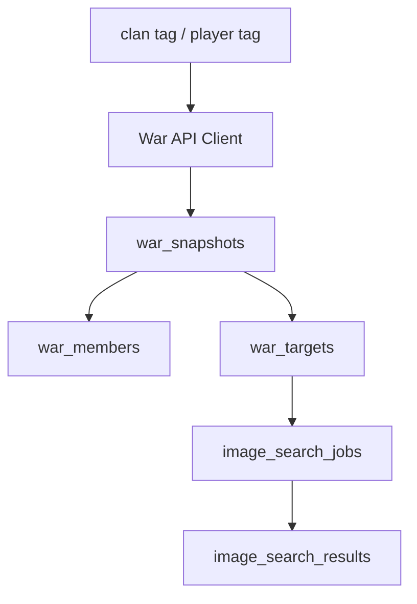

# WarSpark 战争数据技术设计

## 1. 文档目的

本文档定义 WarSpark 战争数据接入的实现逻辑，包括 Clash of Clans 官方 API、缓存、错误状态、战争快照、成员数据和找阵目标上下文绑定。

战争数据是 WarSpark 从“截图找阵工具”升级为“战争情报站”的关键能力，并进入首轮 MVP。它仍不作为截图找阵流程的硬依赖：用户即使没有输入部落 tag 或玩家 tag，也必须能够独立完成截图找阵。

## 2. 功能定位

战争数据用于回答：

- 当前战争双方是谁。
- 双方 TH 分布如何。
- 敌方几号位是什么 TH、被打情况如何。
- 我方攻击次数、星数和摧毁率概况如何。
- 某个敌方目标是否可以绑定一条找阵任务。

MVP 直接接入 Clash of Clans 官方 API，覆盖部落、玩家、当前战争、CWL 基础结构、成员 TH、攻击次数、星数、摧毁率和目标上下文。后续版本再增强历史战争、CWL 轮次深度和复杂统计。

## 3. 模块边界

| 子模块 | 职责 |
| --- | --- |
| War API Client | 调用 Clash of Clans 官方 API，处理认证、限流和响应解析。 |
| War Snapshot Service | 保存战争快照、成员和目标上下文。 |
| War Cache | 缓存官方 API 响应和战争概览。 |
| War Query | 提供战争情报页读取所需数据。 |
| Target Binding | 将敌方目标上下文绑定到找阵任务。 |

边界约束：

- 官方 API 不可用时，不影响截图找阵。
- 缓存不能作为唯一数据源。
- 战争快照保留获取时间，避免页面误把旧数据当作实时数据。
- 不使用非官方客户端自动化或游戏逆向。

## 4. 核心数据关系



涉及实体：

| 实体 | 职责 |
| --- | --- |
| `war_snapshots` | 保存某次战争数据获取结果和双方概览。 |
| `war_members` | 保存快照中的我方和敌方成员状态。 |
| `war_targets` | 表示可绑定找阵任务的敌方目标。 |
| `image_search_jobs` | 可保存目标上下文或关联目标 ID。 |

## 5. 官方 API 接入

### 5.1 查询入口

WarSpark 提供两类入口：

- 部落 tag：用于读取部落、当前战争、CWL 或成员上下文。
- 玩家 tag：用于读取玩家基础信息，后续辅助定位部落和 TH。

### 5.2 API Client 职责

API Client 负责：

1. 标准化 tag 输入。
2. 注入官方 API 访问凭证。
3. 发起请求并解析响应。
4. 识别外部 API 错误。
5. 返回统一错误码给 Service。
6. 记录调用耗时和响应状态。

API Client 不负责写数据库，也不直接拼页面响应。

### 5.3 认证和配置

实现建议：

- API Token 使用环境变量配置。
- 服务启动时校验是否配置了必要凭证。
- 未配置凭证时，战争情报页展示服务未配置状态。
- 不把 Token 写入日志、错误响应或前端。

## 6. 缓存策略

### 6.1 缓存对象

可以缓存：

- 部落基础信息。
- 玩家基础信息。
- 当前战争数据。
- CWL 轮次相关数据。
- 战争情报页概览聚合结果。

### 6.2 缓存键

缓存键建议包含：

- 查询类型。
- 标准化后的 tag。
- 战争类型。
- 数据版本或获取时间段。

示例语义：

```text
war:current:{clan_tag}
clan:profile:{clan_tag}
player:profile:{player_tag}
```

### 6.3 缓存过期

缓存过期需要按数据类型区分：

- 玩家和部落基础信息可以较长。
- 当前战争和攻击状态需要较短。
- 已结束战争快照可以长期保留。

具体 TTL 由实现阶段结合官方 API 限制和产品体验确定。文档层只要求所有页面展示 `fetched_at`，避免用户误解数据时效。

## 7. 战争快照保存

### 7.1 快照生成时机

创建 `war_snapshots` 的场景：

- 用户查询当前战争。
- 用户手动刷新战争情报页。
- 系统周期性刷新已关注战争。
- 战后复盘需要固定一份历史数据。

### 7.2 快照内容

`war_snapshots` 保存：

- 我方部落 tag。
- 敌方部落 tag。
- 战争状态。
- 战争人数。
- 双方星数。
- 双方摧毁率。
- 来源类型。
- 获取时间。

### 7.3 快照使用原则

- 页面展示基于最近可用快照。
- 手动刷新生成新快照或更新当前快照。
- 已结束战争保留最后快照作为复盘依据。
- 快照不可被缓存丢失影响。

## 8. 成员数据保存

### 8.1 成员范围

`war_members` 保存当前快照中的：

- 我方成员。
- 敌方成员。

### 8.2 成员字段

MVP 需要：

- 所属方：我方或敌方。
- 战争地图序号。
- 玩家 tag。
- 玩家名。
- TH 等级。
- 攻击次数。
- 被打最佳星数。
- 被打最佳摧毁率。

### 8.3 成员更新

当官方 API 返回新数据：

1. 解析双方成员列表。
2. 标准化玩家 tag。
3. 按快照写入成员记录。
4. 不在同一快照内覆盖历史攻击结果。
5. 通过新快照表达状态变化。

## 9. 目标上下文绑定

### 9.1 绑定场景

用户可以从战争情报页选择敌方目标并上传截图。此时找阵任务需要携带：

- 敌方序号。
- 敌方玩家名。
- 敌方 TH。
- 当前被打情况。
- 所属战争快照 ID。

### 9.2 绑定方式

MVP 使用 `war_targets` 独立表表达目标上下文，也可以在 `image_search_jobs.target_context` JSON 中保存快照冗余字段，避免历史快照变化影响结果页展示。

推荐策略：

1. 用户从战争情报页点击某个敌方目标。
2. 前端带上目标上下文进入找阵页。
3. 创建找阵任务时写入 `target_context` 或 `war_target_id`。
4. 找阵结果页展示目标上下文。
5. 任务本身仍按图片找阵流程处理。

### 9.3 解耦原则

- 找阵任务失败不影响战争快照。
- 战争 API 失败不影响独立上传找阵。
- 目标上下文只是辅助信息，不参与 MVP 匹配算法。

## 10. 错误状态

| 场景 | 错误状态 | 用户处理 |
| --- | --- | --- |
| Tag 格式错误 | `invalid_tag` | 提示检查 tag。 |
| API Token 未配置 | `api_not_configured` | 展示战争数据暂不可用。 |
| 官方 API 请求失败 | `api_request_failed` | 可重试，不影响找阵。 |
| 目标不存在 | `target_not_found` | 返回战争列表或重新刷新。 |
| 当前无战争 | `war_not_found` | 展示无当前战争状态。 |
| 权限或访问受限 | `api_access_denied` | 展示无法读取战争数据。 |
| 响应解析失败 | `api_response_invalid` | 记录错误并提示稍后重试。 |

错误处理要求：

- 用户可见错误使用业务文案。
- 内部日志记录外部状态码、请求类型和 tag 哈希或脱敏值。
- 不向前端返回 API Token 或原始敏感响应。

## 11. 页面数据服务

### 11.1 战争情报页

战争情报页读取：

- 最近战争快照。
- 双方概览。
- TH 分布。
- 敌方目标列表。
- 我方成员攻击次数。
- 数据获取时间。
- 刷新状态。

MVP 阶段必须返回官方 API 数据或明确错误状态，不再使用占位状态替代真实接入。

### 11.2 找阵结果页

找阵结果页只读取绑定上下文：

- 目标序号。
- 目标玩家名。
- 目标 TH。
- 当前被打情况。

如果上下文为空，页面隐藏目标区域或展示普通找阵模式。

## 12. 复盘预留

战后复盘需要基于战争快照扩展：

- 攻击记录。
- 防守记录。
- 哪些阵型被打出高星或低星。
- 哪些视频和阵型需要沉淀。

MVP 不实现完整复盘，但战争快照和成员表需要保留足够字段，避免后续重建数据结构。

## 13. 安全与合规

- 只使用 Clash of Clans 官方 API。
- 不自动化游戏客户端。
- 不读取用户私有聊天或私域频道。
- 不把官方 API Token 暴露到前端。
- 日志中对 tag 和外部响应做必要脱敏。
- API 不可用时，页面必须降级而不是阻塞找阵。

## 14. 非目标

本阶段不做：

- 完整 War Report 复刻。
- 多账号同步。
- 推送提醒。
- 历史战争大盘。
- 自动分配攻击目标。
- AI 打法推荐。
- 小组件或移动 App。

## 15. 验收标准

战争数据技术设计视为可进入实现时，需要满足：

- 官方 API、缓存、快照、成员和目标上下文职责清晰。
- 找阵流程与战争数据接入解耦。
- 战争情报页能基于快照展示数据获取时间和错误状态。
- 找阵任务可以绑定敌方目标上下文。
- API 不可用、无当前战争、权限受限等状态有明确处理。
- 不使用非官方客户端自动化或私域数据抓取作为默认路径。
