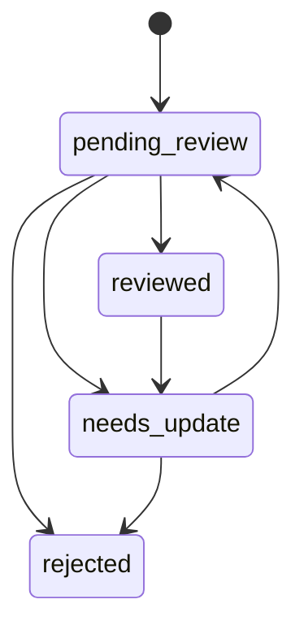

# WarSpark 内容运营流程

## 1. 文档目的

本文档定义 WarSpark 内容运营流程，覆盖阵型图片、OpenLayout、YouTube 视频时间戳、失效链接、审核状态和找阵结果沉淀的日常处理方式。

本文档面向产品、运营、开发和后续审核人员，帮助团队在没有完整运营后台的早期阶段，也能用一致规则维护阵型库和视频资料库。

## 2. 运营目标

内容运营的目标不是堆积大量阵型，而是持续提高找阵结果的可用性：

- 阵型图片清晰、来源可追踪。
- OpenLayout 链接可用或状态明确。
- 视频时间戳能打开到相关片段。
- 进攻视频和防守回放分组准确。
- 低可信、失效、来源不足的内容不被包装成高可信结果。
- 找阵结果中有价值的阵型和链接可以沉淀到阵型库。

## 3. 内容类型

| 内容 | 运营重点 |
| --- | --- |
| 阵型图片 | 清晰度、TH、来源、主图角色、是否可公开。 |
| OpenLayout | 链接格式、可用状态、来源、最后检查时间。 |
| YouTube 视频 | 视频 ID、标题、频道、时间戳、可访问状态。 |
| 视频时间戳 | 片段是否相关、进攻或防守分组、关联精度。 |
| 找阵结果 | 是否值得沉淀、是否匹配已有阵型、是否需要审核。 |
| 战争复盘资料 | 攻击结果、防守结果、可沉淀阵型和视频。 |

## 4. 运营角色

MVP 阶段可以不实现角色系统，但流程上区分职责：

| 角色 | 职责 |
| --- | --- |
| 内容整理者 | 收集公开来源、整理图片、链接和视频时间戳。 |
| 审核者 | 确认来源、质量、关联精度和公开可见性。 |
| 开发者 | 提供导入脚本、状态字段、链接检查和页面展示。 |
| 产品负责人 | 决定内容边界、文案承诺和范围取舍。 |

早期一个人可以承担多个角色，但每条内容仍需要按状态流转。

## 5. 来源处理流程

### 5.1 公开页面整理

处理步骤：

1. 确认页面公开可访问。
2. 记录来源 URL。
3. 提取阵型图片、TH、类型、风格标签。
4. 提取 OpenLayout 或其他复制链接。
5. 如有视频，提取 YouTube 视频 ID 和时间戳。
6. 标记 `source_type = public_page`。
7. 设置初始审核状态和质量状态。

要求：

- 不绕过登录和付费限制。
- 不把来源不明内容标记为已审核。
- 不把相似视频标记为精确关联。

### 5.2 授权导入

处理步骤：

1. 确认导入文件或表格由用户授权提供。
2. 保存导入批次信息。
3. 校验字段完整性。
4. 导入阵型、图片、链接和视频时间戳。
5. 设置 `source_type = authorized_import`。
6. 进入审核和链接检查流程。

要求：

- 保留导入来源说明。
- 导入失败需要记录错误行和原因。
- 授权导入不等于自动公开。

### 5.3 人工录入

处理步骤：

1. 创建阵型主记录。
2. 上传或填写阵型图片。
3. 填写 TH、类型、风格和来源。
4. 添加 OpenLayout。
5. 添加视频时间戳。
6. 由审核者确认后公开。

适用场景：

- 种子数据。
- 高价值阵型补录。
- 修复来源不完整的内容。
- 战后复盘补充资料。

### 5.4 找阵结果沉淀

处理步骤：

1. 检查找阵结果是否已有对应阵型。
2. 如果已有阵型，只追加匹配记录或证据。
3. 如果没有阵型，创建隐藏或低可信阵型。
4. 保存上传图或候选图作为参考图。
5. 标记 `source_type = search_result`。
6. 设置 `pending_review` 和低或中可信状态。
7. 后续人工补充来源、OpenLayout 和视频。

要求：

- 用户上传截图不自动成为公开主图。
- 沉淀内容先服务内部审核，不直接进入公开列表。
- 无 TH 或明显非阵型截图不沉淀。

## 6. 审核流程

### 6.1 审核检查项

| 检查项 | 标准 |
| --- | --- |
| 来源 | 是否有公开 URL、授权说明或人工录入说明。 |
| TH | 是否能确认 Town Hall 等级。 |
| 图片 | 是否清晰、完整、适合作为主图或参考图。 |
| 链接 | OpenLayout 是否格式正确，状态是否可用。 |
| 视频 | 时间戳是否能打开相关片段。 |
| 分组 | 视频是否正确区分进攻视频和防守回放。 |
| 精度 | 是否正确标记精确、相似或同 TH 参考。 |
| 文案 | 是否避免推荐打法、最佳打法等强承诺。 |

### 6.2 审核结果

| 结果 | 处理 |
| --- | --- |
| `reviewed` | 内容可按可见性进入公开展示。 |
| `needs_update` | 内容需要补来源、修图、修链接或补视频。 |
| `rejected` | 内容不公开展示，保留记录用于追踪。 |

审核通过不代表链接永久有效。链接状态需要单独维护。

## 7. 阵型图片运营

### 7.1 图片角色

| 角色 | 用途 |
| --- | --- |
| `primary` | 阵型库列表和详情主图。 |
| `upload` | 用户找阵上传图。 |
| `candidate` | 找阵候选图。 |
| `reference` | 参考图或补充图。 |

### 7.2 主图选择规则

主图需要满足：

- TH 清楚。
- 阵型主体完整。
- 图片质量足够展示。
- 来源可追踪。
- 审核状态通过。

用户上传图只有在经过人工确认和来源处理后，才能从 `upload` 或 `candidate` 转为 `primary`。

### 7.3 图片异常处理

| 场景 | 处理 |
| --- | --- |
| 图片打不开 | 标记内容需要更新，前端展示占位。 |
| 图片模糊 | 降低质量状态或替换主图。 |
| 图片来源不明 | 不作为公开主图。 |
| 图片与 TH 不匹配 | 修正 TH 或拒绝该图片。 |

## 8. OpenLayout 运营

### 8.1 添加链接

添加 OpenLayout 时记录：

- 链接 URL。
- 阵型 ID。
- 来源类型。
- 来源 URL。
- 初始链接状态。

### 8.2 检查链接

链接检查方式：

- 人工打开确认。
- Worker 做格式和轻量可访问性检查。
- 用户反馈后复核。

检查结果：

| 结果 | 状态 |
| --- | --- |
| 可打开 | `active` |
| 暂未确认 | `unverified` |
| 已失效 | `broken` |
| 无链接 | `missing` |

### 8.3 失效链接处理

处理步骤：

1. 标记 `broken`。
2. 禁用前端打开和复制动作。
3. 查找备用链接。
4. 如果找到新链接，新增或替换为 `active`。
5. 保留旧链接记录和检查时间。

不要直接删除失效链接，否则难以追踪来源和问题。

## 9. YouTube 视频时间戳运营

### 9.1 添加视频

添加视频时记录：

- YouTube 视频 ID。
- 视频标题。
- 频道名称。
- 时间戳秒数。
- 来源 URL。
- 关联阵型。
- 进攻视频或防守回放分组。
- 关联精度。
- 星数和摧毁率。

### 9.2 时间戳审核

审核者需要确认：

- 视频公开可访问。
- 时间戳跳转有效。
- 片段与阵型或相似阵型相关。
- 结果星数和摧毁率记录正确。
- 分组和关联精度准确。

### 9.3 视频失效处理

| 场景 | 处理 |
| --- | --- |
| 视频被删除 | 标记不可访问，隐藏或展示失效状态。 |
| 时间戳不相关 | 调整时间戳或降低关联精度。 |
| 视频标题变化 | 更新标题，不改变关联记录。 |
| 同一视频多个片段 | 保留一个视频主记录，增加多个时间戳关联。 |

### 9.4 文案边界

视频展示使用：

- 相关攻击视频。
- 防守回放。
- 同阵参考。
- 相似参考。
- 同 TH 参考。

不使用：

- 推荐打法。
- 最佳打法。
- 必三星打法。
- 自动配兵。

## 10. 低可信内容处理

低可信内容可以保留，但需要明确标记。

适用场景：

- 找阵结果自动沉淀。
- 只有同 TH 视频参考。
- 图片来源完整性不足。
- OpenLayout 未验证。
- 视频片段只与相似阵相关。

处理原则：

- 不作为默认高质量结果排序第一位。
- 页面展示低置信度提示。
- 审核时优先补来源、补链接和补视频。
- 无法补全时保持低可信或隐藏。

## 11. 日常运营节奏

### 11.1 每日检查

- 查看新找阵结果沉淀内容。
- 查看新增失效链接反馈。
- 查看视频不可访问反馈。
- 处理高频 TH 的无结果样本。

### 11.2 每周整理

- 补充高频 TH 阵型。
- 检查 OpenLayout 失效率。
- 检查视频时间戳质量。
- 合并重复阵型。
- 更新高价值阵型主图。

### 11.3 版本发布前检查

- 抽查热门 TH 的找阵结果页。
- 抽查阵型详情页 OpenLayout。
- 抽查进攻视频和防守回放分组。
- 检查内容边界是否被破坏。
- 检查低可信内容是否有明确标记。

## 12. 指标

内容运营关注：

- 找阵有结果率。
- 低置信度结果占比。
- OpenLayout 失效率。
- 视频失效率。
- 结果页视频点击率。
- OpenLayout 打开或复制率。
- 找阵结果沉淀为阵型记录的比例。
- 沉淀内容通过审核的比例。
- 阵型库列表到详情页点击率。

指标用于判断内容质量，不用于承诺算法精度。

## 13. 风险与处理

| 风险 | 处理 |
| --- | --- |
| 来源不清 | 不公开或标记需要更新。 |
| 链接大量失效 | 批量检查并优先修复热门阵型。 |
| 视频关联错误 | 降低关联精度或撤下关联。 |
| 用户误解为推荐打法 | 调整文案为参考视频。 |
| 私域内容边界不清 | 不接入，先走授权导入流程设计。 |
| 低质量内容过多 | 限制公开展示，提高审核门槛。 |

## 14. MVP 不做

内容运营 MVP 不做：

- 完整后台审核系统。
- 用户投稿审核闭环。
- 自动抓取平台。
- 私域内容抓取。
- YouTube 视频下载。
- 自动生成攻略正文。
- 付费阵型运营。

## 15. 验收标准

内容运营文档视为可执行时，需要满足：

- 阵型图片、OpenLayout、视频时间戳和找阵结果沉淀都有处理流程。
- 审核状态、质量状态、链接状态有明确运营含义。
- 失效链接和失效视频有处理流程。
- 用户上传截图不会直接公开。
- 进攻视频和防守回放的分组维护规则清晰。
- 内容边界与 `docs/product/content-data-policy.md` 一致。
